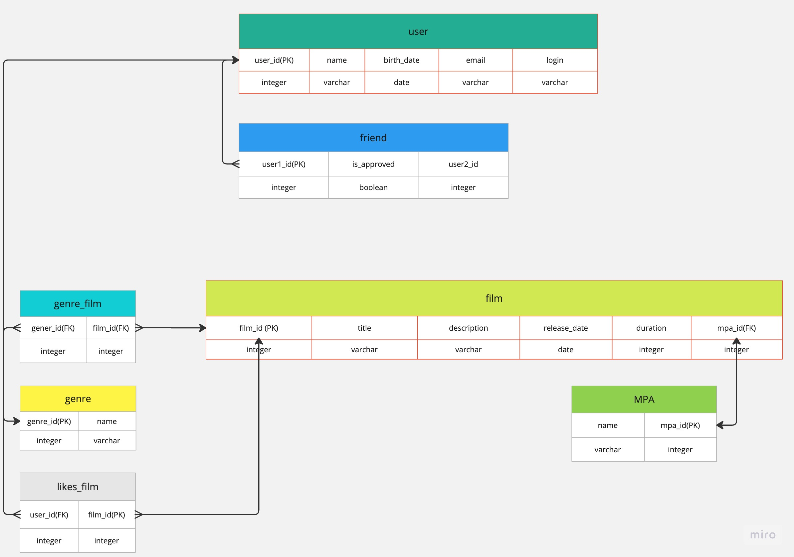

# java-filmorate
Template repository for Filmorate project.

В таблице User храняться все пльзователи приложения
В таблице Friends храняться все дружественные связи со статусом их подтвреждения

В таблице Film храняться все фильмы
В талице MPA храняться все рейтинги фильмов, а в Film добавляется только индекс нужного рейтинга
сделано так что бы убрать избыточность
В таблице genre храняться все жанры и так как связь к фильма многие ко многим выделена таблица для связи genre_film
В таблице likes храняться все id пользователе которым понравился фильма

Запросы

1.Для получения таблицы всей информации обо всех пользователях
SLECT *
FROM user;

2.Для получения таблицы всех пользователей и их друзей
SELECT u.name,
f.isApproved,
u2.name
FROM user u
JOIN friend f ON f.id_user1 = u.id;
JOIN user u2 ON u2.id = f.id_user2

2.Для получения таблицы конкретного пользователя и его друзей
SELECT u.name,
f.isApproved,
u2.name
FROM user u
JOIN friend f ON f.id_user1 = u.id;
JOIN user u2 ON u2.id = f.id_user2
WHERE u.id = {id}

3.Для полученя таблицы всех фильмов и информации о них
SELECT *
FROM film

4.Для получения таблицы всех пользователе кому понравился конкретный фильма
SELECT likes.id_user
FROM film f
JOIN likes_film likes ON likes.id_film = f.id
WHERE f.id = {id}

5.Для получения таблицы всех жанров конкретного фильма
SELECT g.name
FROM film f
JOIN genre_film gf ON gf.id_film = film.id
JOIN genre g ON g.id = gf.id_genre
WHERE f.id = {id}